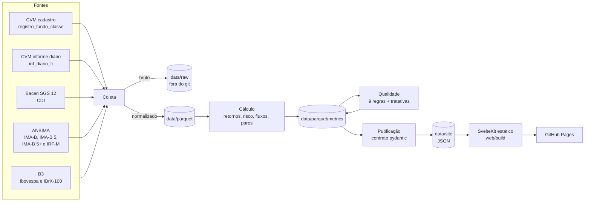

# fund-monitor

**Site:** https://viniaraujo68.github.io/fund-monitor/

**Para avaliar:** 1. [Como funciona](https://viniaraujo68.github.io/fund-monitor/como-funciona/) (roteiro da apresentação) · 2. [Visão geral](https://viniaraujo68.github.io/fund-monitor/) · 3. [Qualidade](https://viniaraujo68.github.io/fund-monitor/qualidade/)

Monitor diário dos fundos não exclusivos da Icatu Vanguarda, feito só com dados públicos da CVM, do Bacen, da ANBIMA e da B3. Um pipeline em Python coleta, calcula e confere os dados todo dia útil, e um site estático mostra o resultado.

## O que ele responde

1. **Como cada fundo rendeu** contra o seu benchmark e contra os seus pares?
2. **Para onde o dinheiro está indo?** Captação líquida por fundo e por classificação.
3. **Em que dado não dá para confiar?** Nove regras de qualidade, com alerta por fundo e por dia, e a tratativa de cada alerta.

## Fluxo



As etapas de cálculo, qualidade e publicação leem só Parquet: dá para refazer o site de qualquer dia a partir do commit daquele dia, sem baixar nada.

## Como rodar

Pipeline (Python 3.12, [uv](https://docs.astral.sh/uv/)):

```sh
cd pipeline
uv run --frozen pytest -q
uv run --frozen python -m fund_monitor.run
```

As etapas que rodam ficam na constante `STAGES` de `pipeline/src/fund_monitor/run.py` (`collect`, `calc`, `quality`, `publish`). Com a coleta, a primeira execução baixa cerca de 275 MB e leva uns 12 minutos, quase todos na ANBIMA (um pedido por dia).

Site (Node 22):

```sh
cd web
npm ci
npm run dev
BASE_PATH=/fund-monitor npm run build
```

**Rotina diária.** `.github/workflows/daily.yml` roda de segunda a sexta às 20h17 de Brasília: testes, pipeline, commit de `data/parquet` e `data/site` quando mudam, build e publicação no GitHub Pages. `pages.yml` publica o site a cada push na `main`.

## Repositório

| Pasta | O que tem |
| --- | --- |
| `pipeline/` | Coleta (`collect/`), cálculo (`calc/`), regras de qualidade (`quality/`), publicação do JSON (`publish/`) e testes |
| `web/` | Site em SvelteKit com o design system plinth e Chart.js |
| `data/` | Parquet normalizado e métricas, JSON do site e `triage.json` com as tratativas; o bruto fica fora do git |
| `docs/` | Decisões e metodologia, achados nos dados reais, como seria em produção |
| `.github/workflows/` | Rotina diária e publicação do site |

## Três achados nos dados reais

- **Evento de crédito, 09/12/2024:** 13 séries de crédito da gestora (10 quedas distintas) caíram junto com fundos de crédito de outras gestoras, sem movimento de índice que explique; provável remarcação de um emissor presente em várias carteiras.
- **Linha zerada, 16/03/2026:** uma subclasse com cerca de 1.470 cotistas informou cota, PL e cotistas iguais a zero.
- **Distribuição informada como resgate:** o `54023112000197` informa um resgate de cerca de 1 % do PL todo mês; o PL cai uma vez só, pela cota, e o resgate informado fica sem contrapartida no PL.

Detalhes em [`docs/findings.md`](docs/findings.md).

## Principais limitações

- A cota não é ajustada por amortização ou distribuição, o que subestima o retorno dos incentivados.
- O benchmark é o índice que a série declara no cadastro quando o monitor o coleta (IMA-B, IMA-B 5, IMA-B 5+, IRF-M, IBrX-100); senão, vem da classificação CVM, não do regulamento.
- Os pares existem só para Público Geral, e a comparação é antes do IR do cotista. O corte de PL acima de R$ 50 milhões vale para os pares, não para o fundo avaliado.
- A decomposição mensal do PL supõe que todo o fluxo acontece no fim do mês.
- Não há carteira: um evento de crédito é inferido pela cota, não confirmado pelo emissor.
- O PL "Da gestora" soma por classe e conta duas vezes o FIC da casa e o fundo da casa em que ele investe; separar pede a carteira de cada FIC ([`DECISIONS.md`, seção 4.4](docs/DECISIONS.md#44-fluxos-e-tamanho)).
- Quem declara "OUTROS" como benchmark segue a classificação CVM: as duas séries de IMA-B 5 pelo nome são comparadas com o IMA-B e com o Ibovespa ([`DECISIONS.md`, seção 4.5](docs/DECISIONS.md#45-benchmark-por-série)).

A lista completa está em [`docs/DECISIONS.md`, seção 7](docs/DECISIONS.md#7-limitações-conhecidas).

## Documentos

- [`docs/DECISIONS.md`](docs/DECISIONS.md): fontes, universo, fórmulas, regras de qualidade e o que cada tela mostra.
- [`docs/PRODUCTION.md`](docs/PRODUCTION.md): como seria em produção, com tempo e equipe.
- [`docs/findings.md`](docs/findings.md): o que os dados reais mostraram.
